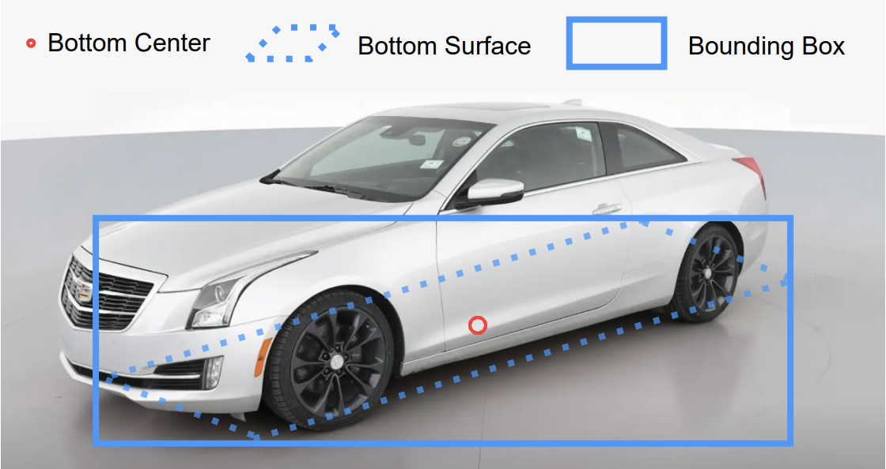
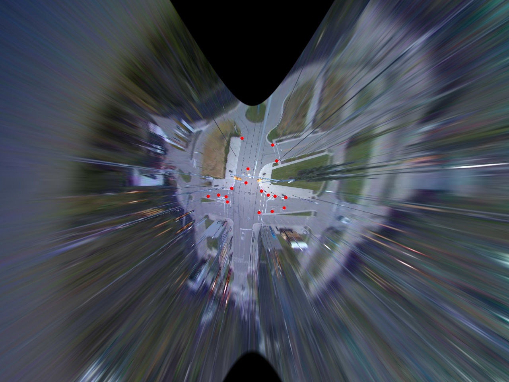

# 2D Camera Perception Pipeline Tutorial

This tutorial demonstrates an end-to-end **roadside 2D-camera perception** workflow in MSight. The overall pipeline covers:

1. Image retrieval (from a camera stream, recorded bag, or file directory)
2. 2D object detection
3. Localization (2D → 3D projection into world coordinates)
4. Sensor fusion (optional, if multiple cameras/sensors are present)
5. Multi-object tracking
6. State estimation for downstream applications

---

## Object Detection

Most off-the-shelf object detectors (including YOLO) output **2D bounding boxes** in image coordinates. However, MSight’s downstream modules (localization, tracking, fusion) typically assume that the detection is **consistent with the object’s ground contact point**, because that point is later projected into 3D.

In roadside settings, a naïve 2D bounding box often has a center that drifts with occlusions, truncation, perspective, or tall vehicle bodies (e.g., buses). To make localization more stable, MSight adopts a labeling approach that explicitly encodes the object’s **bottom footprint**.

### MSight YOLO labeling convention (bottom footprint)

When preparing training data for YOLO to be used inside the MSight pipeline, we label each vehicle using **three bottom corners** of its 3D footprint (the fourth corner can be inferred because the footprint is a parallelogram).

We then compute a 2D bounding box as:

* **x-range** = min/max x of the 4 inferred footprint corners
* **y-range** = min/max y of the 4 inferred footprint corners

This guarantees that the resulting 2D bounding box center aligns with the vehicle’s **bottom center**, which is the key point used by the subsequent localization module. The following figure shows the labeling process:

{width="100%"}

### Using Ultralytics YOLO in MSight

MSight can directly use Ultralytics YOLO object detectors:

* [Ultralytics YOLO documentation](https://docs.ultralytics.com/tasks/detect/)

Training is the same as standard YOLO training. The only MSight-specific part is the labeling convention described above.

---

### Example training dataset

We provide example data that follows the MSight YOLO labeling convention:

* [**Example data for training**](https://d1avza5eyi8p22.cloudfront.net/msight/mcity_example_data_for_yolo/mcity_data_yolo.zip)

This dataset contains roughly **~200 images** collected at Mcity, labeled in the footprint-based format described above, and already organized in the Ultralytics YOLO training directory structure.

**Training guide:** Refer to the official Ultralytics YOLO training documentation for dataset structure, configuration files, and training commands: [https://docs.ultralytics.com/modes/train/](https://docs.ultralytics.com/modes/train/)

### Example: train YOLO26 with Python

Below is a **minimal Python example** showing how to train a **YOLOv26 detector** using Ultralytics, consistent with the MSight labeling convention. You can extract the data downloaded above into the same folder structure and run the `train.py` script.

```python
from ultralytics import YOLO
from pathlib import Path


def main():
    # Path to your dataset YAML file (Ultralytics format)
    # Example: mcity_yolo.yaml
    data_yaml = "./mcity_data_yolo/mcity_yolo.yaml"

    # Initialize YOLOv26 model
    # You can also start from a pretrained checkpoint if desired
    weights = "yolo26n.pt"
    model = YOLO(weights)
    project = Path("./runs")
    name = "yolo26"

    # Train the model
    model.train(
        data=data_yaml,
        imgsz=640,
        epochs=100,
        batch=16,
        device=0,        # use GPU 0; set to "cpu" if no GPU is available
        workers=8,
        project=str(project),
        name=name,
    )


if __name__ == "__main__":
    main()
```

After training completes, the best-performing weights will be saved under:

```
runs/yolo26_stripline/weights/best.pt
```

These weights can be used directly in the MSight pipeline or for offline visualization and benchmarking, as shown in the next section.

---

### Visualize inference performance on the test set

After training, you can use the script below to run inference over a short test folder, print per-image inference latency, and generate a video preview **without drawing class labels or confidence scores**.

> Notes:
>
> * The script iterates images in sorted order.
> * Frames are resized to match the first frame to keep the output video stable.
> * The video FPS is set to 10 by default (i.e., 0.1s per frame).

```python
import time
from pathlib import Path

import cv2
from ultralytics import YOLO

IMG_EXTS = {".jpg", ".jpeg", ".png", ".bmp", ".webp", ".tif", ".tiff"}


def iter_images(img_dir: str | Path) -> list[Path]:
    img_dir = Path(img_dir)
    if not img_dir.exists():
        raise FileNotFoundError(f"Image directory not found: {img_dir}")

    paths = [
        p for p in img_dir.rglob("*")
        if p.is_file() and p.suffix.lower() in IMG_EXTS
    ]
    return sorted(paths)


def main():
    # -------- paths --------
    weights = r"./runs/msight_yolo26n/weights/best.pt"
    img_dir = r"./test-data/ne"
    # ----------------------

    imgsz = 640
    conf_thres = 0.25
    device = None        # "0" for GPU, "cpu" for CPU, None = auto

    show = True          # set True to see a preview window

    model = YOLO(weights)

    paths = iter_images(img_dir)
    if not paths:
        raise RuntimeError(f"No images found in: {img_dir}")

    print(f"[OK] Found {len(paths)} images")

    # ---- warmup (important for stable timing) ----
    first = cv2.imread(str(paths[0]))
    if first is None:
        raise RuntimeError(f"Cannot read first image: {paths[0]}")
    _ = model.predict(first, imgsz=imgsz, conf=conf_thres, device=device, verbose=False)

    for idx, p in enumerate(paths, 1):
        img = cv2.imread(str(p))
        if img is None:
            print(f"[WARN] Cannot read: {p}")
            continue

        t0 = time.perf_counter()
        results = model.predict(
            source=img,
            imgsz=imgsz,
            conf=conf_thres,
            device=device,
            verbose=False,
        )
        infer_ms = (time.perf_counter() - t0) * 1000.0

        # Draw ONLY bounding boxes (no label, no confidence)
        annotated = results[0].plot(labels=False, conf=False)

        n_boxes = int(len(results[0].boxes)) if results[0].boxes is not None else 0
        print(
            f"[{idx:05d}/{len(paths):05d}] "
            f"{p.name} | boxes={n_boxes} | infer={infer_ms:.2f} ms"
        )

        if show:
            cv2.imshow("YOLO Playback", annotated)
            if cv2.waitKey(1) & 0xFF in (ord("q"), 27):
                break

    if show:
        cv2.destroyAllWindows()

    print("[OK] Detection complete.")


if __name__ == "__main__":
    main()
```

You should see something similar in the following video, and congratulations on successfully training and completed the first step of the MSight 2D perception pipeline!


<video autoplay muted loop playsinline width="100%">
  <source src="./yolo_playback.mp4" type="video/mp4">
</video>

!!! note "Trained weights available"
    The downloaded data already contains a trained weight. If you don't want to train it yourself, you can use the provided weights for the subsequent steps—just unzip everything to the root of the project.

---

## Calibration

 In the detection step, the object detector is able to find vehicles in the image, however, our end goal is to locate them in 3D space. Calibration is the step that perform this magic. It maps an **image pixel** (u, v) into a **3D world location**. In MSight, the calibration result is typically used by the localization stage to convert the **bottom-center** of a detection box into a stable world-space position.

At a high level, we build a set of **point correspondences** between:

* **World / map coordinates** (picked on a satellite map)
* **Image pixel coordinates** (picked on the camera image)

These point pairs allow MSight to solve for a camera-to-world mapping and then generate a dense **pixel → world** lookup map.

---

### Step 1: Create point pairs with the web calibration tool

MSight provides a lightweight web tool for collecting point pairs: [map2picturecalibration.net](https://map2picturecalibration.net/)

**Workflow**

1. **Load the camera image**: `File → Pick Image`
2. You will see:

   * a **satellite image** on the **left**
   * the **camera image** on the **right**
3. Click **“Add Marker”** to create a new **point pair**:

   * one marker on the satellite image
   * one marker on the camera image
4. **Drag** both markers to the correct landmark locations (curb corners, lane markings, stop bar corners, crosswalk corners, etc.).
5. Repeat until you have **~10+ point pairs** distributed across the scene (cover near/far and left/right regions; avoid clustering points).
6. Export the result: `File → Export Results`

**Tip:** You can load an existing example calibration to understand the expected format:

* `File → Import Results` and choose a JSON file under the example calibration folder.

And you should see something like this picture:


---

### Step 2: Build the pixel→world map with the MSight calibration library

Once you have exported the point-pair JSON, use the MSight calibration library:

* [https://github.com/michigan-traffic-lab/camera_calibration2](https://github.com/michigan-traffic-lab/camera_calibration2)

In our example, we use a **fisheye camera**, so we enable `--fisheye`.

```bash
python build_pixel2world_map_minimal_example.py \
  -i ./path/to/calibrationResults.json \
  --intrinsic-parameters-path ./path/to/intrinsics.json \
  --fisheye \
  --sample-image ./path/to/sample_image.jpg \
  -o calibration_results.npz
```

**What this command does**

* Inputs:

  * `-i`: exported **point-pair JSON** from the web tool
  * `--intrinsic-parameters-path`: camera **intrinsics** (and distortion parameters)
  * `--sample-image`: an example image used for size/validation
  * `--fisheye`: enable fisheye projection / distortion handling
* Output:

  * `-o calibration_results.npz`: a saved **pixel → lat/lon** (or pixel → world) mapping used by MSight localization.

The intrinsics JSON should look like this (example for Mcity cameras):

```json
{
  "f": 339.256,
  "x0": 629,
  "y0": 460
}
```

Where:

* `f`: focal length in pixels
* `x0`, `y0`: principal point in pixels (center of the circle)

These parameters should be able to found on your camera datasheet or calibration report, if not, you can calibrate the intrinsics using standard tools such as [OpenCV](https://docs.opencv.org/3.4/db/d58/group__calib3d__fisheye.html).

For GridSmart cameras, you can use the equidistant model parameters from the GridSmart calibration report, where `K=[0, 0, 0, 0]`, and the focal length `f` can be estimated as the radius of the circle (in pixel) divided by `pi/2`. The code will undistort the fisheye image and find the best homography transformation.



!!! note "Calibration files provided"
    We also provide the calibration files and results for this tutorial, they are included in the [repository](https://github.com/michigan-traffic-lab/MSight_tutorials/tree/main/2d_perception_pipeline). You can find them under the `calibration` folder, and use them directly for the next step if you don't want to go through the calibration process yourself.

In the next section, we will show how to load this `.npz` calibration artifact inside the MSight localization module and validate the mapping on real detections.

## Localization, Sensor Fusion, Tracking, and State Estimation

This section describes how MSight converts raw 2D detections into **consistent world-space object states** by chaining localization, (optional) multi-sensor fusion, multi-object tracking, and state estimation. The full pipeline is implemented in `run_perception_pipeline.py`, and the code snippet below illustrates how each module is initialized and executed per frame.

At a high level, each pipeline iteration processes one timestep as follows:

1. Retrieve synchronized images from one or more cameras
2. Run 2D object detection per camera
3. Project detections into world coordinates (localization)
4. Fuse detections across sensors (if applicable)
5. Track objects over time
6. Estimate kinematic state (position, velocity, heading)
7. Visualize and optionally record results

---

### 1. Image Retrieval

The pipeline starts by loading images using `ImageRetriever`. Images are returned as a dictionary keyed by sensor name, which allows the same pipeline to scale naturally from a single camera to multi-camera deployments.

```python
img_dir = Path("./test-data")
img_retriever = ImageRetriever(img_dir=img_dir)
```

Each entry contains:

* the image frame (`image`)
* a timestamp (`timestamp`)

This structure ensures that downstream modules (fusion, tracking) can reason about sensor identity and timing explicitly.

---

### 2. 2D Object Detection

For each sensor image, a `Yolo26Detector` is applied. This detector wraps Ultralytics YOLOv26 and outputs MSight-native detection objects that are compatible with localization and tracking modules.

```python
detector = Yolo26Detector(
    model_path=Path(model_path),
    device=device,
    confthre=confthre,
    nmsthre=nmsthre,
    fp16=False,
    class_agnostic_nms=class_agnostic_nms,
    end2end=end2end,
)
```

Per frame:

```python
result = detector.detect(img, timestamp, "fisheye")
```

Each detection contains a 2D bounding box whose **center corresponds to the bottom footprint center**, making it suitable for geometric projection in the next step.

---

### 3. Localization (2D → World Coordinates)

Localization converts each detection from image coordinates into a **world-space latitude / longitude** (or local map coordinates), using the pixel→world lookup maps generated during calibration.

Each camera has its own `HashLocalizer`, initialized from the calibration `.npz` artifact:

```python
localizers = {
    key: HashLocalizer(lat_map=item['lat_map'], lon_map=item['lon_map'])
    for key, item in loc_maps.items()
}
```

During runtime:

```python
localizer.localize(detection_result)
```

Internally, the localizer:

* takes the bottom-center of each bounding box
* looks up the corresponding world coordinate
* writes `obj.lat` and `obj.lon` into each object

Objects that fail localization (e.g., projected outside the calibrated region) are filtered out:

```python
detection_result.object_list = [
    obj for obj in detection_result.object_list
    if is_number(obj.lat) and is_number(obj.lon)
]
```

This step produces **metric-consistent detections** suitable for fusion and tracking.

---

### 4. Multi-Sensor Fusion

When multiple cameras observe overlapping regions, MSight performs spatial fusion using a `HungarianFuser`.

```python
fuser = HungarianFuser(
    coverage_zones=config["fusion_config"]["coverage_zones"]
)
```

Fusion:

```python
fusion_result = fuser.fuse(detection_buffer)
```

Key characteristics:

* Associations are solved using Hungarian matching in world space
* Each physical object appears **at most once** in the fused output
* Coverage zones define which sensors are trusted in which regions

For single-camera setups, this step is still executed but effectively acts as a pass-through.

---

### 5. Multi-Object Tracking

Tracking assigns **persistent IDs** to objects over time using a SORT-based tracker operating in world coordinates.

```python
tracker = SortTracker(
    use_filtered_position=config["tracker_config"].get("use_filtered_position", False),
    output_predicted=config["tracker_config"].get("output_predicted", False),
)
```

Tracking step:

```python
tracking_result = tracker.track(fusion_result)
```

The tracker:

* matches current detections to existing tracks
* handles object appearance and disappearance
* optionally outputs predicted positions when detections are missing

This produces temporally consistent trajectories required for motion analysis.

---

### 6. State Estimation

After tracking, MSight estimates object kinematic states using a lightweight finite-difference estimator:

```python
state_estimator = FiniteDifferenceStateEstimator()
result = state_estimator.estimate(tracking_result)
```

The estimator computes:

* velocity
* heading

This step prepares the data for downstream modules such as:

* conflict detection
* behavior analysis
* cooperative perception message generation

---

### 7. Visualization and Output

Finally, results are wrapped into a `Frame` object and rendered using the MSight visualizer:

```python
result_frame = Frame(step)
for obj in result:
    result_frame.add_object(obj)

vis_img = visualizer.render(result_frame, with_traj=True)
```

For debugging and evaluation, the pipeline also visualizes:

* world-space trajectories on a map background
* per-camera 2D detections

Both views are concatenated side-by-side and optionally written to a video file (`output_pipeline.mp4`) for offline inspection.

---

### Summary

By the end of this stage, the pipeline has transformed raw camera images into:

* stable world-space object positions
* consistent object identities across time
* estimated kinematic states

These outputs form the foundation for higher-level MSight applications such as near-miss detection, traffic analytics, and real-time roadside intelligence deployment. The pipeline code is provided in the tutorial repository, named `run_perception_pipeline.py`, when running the code, you should see a visualization similar to below:


<video autoplay muted loop playsinline width="100%">
  <source src="./output_pipeline.mp4" type="video/mp4">
</video>

Congratulations! You have successfully implemented a complete 2D camera perception pipeline using MSight. You can now use this pipeline for various roadside perception applications, such as traffic monitoring, vehicle tracking, and more. 

!!! tip "Deployment"
    MSight Vision provides MSight Core Node that wraps all the functionalities as data processing nodes, making this very easy to deploy in real roadside infrastructure. The perception nodes only need the config file used in this tutorial to process the real-time image data. You can refer to the [other tutorials](../../index.md) for more details on how to set up and run the perception pipeline in a production environment.
