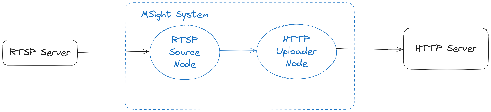

# 📘 MSight Tutorial: Uploading RTSP Images to a Custom HTTP Server

In this tutorial, you will learn how to:

- Run an RTSP camera simulator in Docker  
- Use MSight’s **RTSP Receiver Node** to capture frames  
- Launch a custom HTTP server  
- Use MSight’s **HTTP Uploader Node** to upload image data over HTTP  
- Extract base64 images and save them on the server  

This is exactly the pipeline shown in the figure:

{ width="100%" }

---

## ✅ Prerequisites

Before starting, make sure you have:

- **Docker** installed  
- **MSight** installed (`msight_launch_rtsp`, `msight_launch_http` available)

---

## Step 1. Start an RTSP server using Docker Compose

Prepare a video file, name it `sample.mp4`. Create a file in the same folder called **docker-compose.yml**:

```yaml
version: "3.9"

services:
  rtsp-server:
    image: bluenviron/mediamtx:latest
    container_name: rtsp-server
    restart: unless-stopped
    ports:
      - "8554:8554"        # RTSP
    environment:
      MTX_PROTOCOLS: "udp,tcp"   # allow both

  video-source:
    image: jrottenberg/ffmpeg:4.4-alpine
    container_name: rtsp-video-source
    restart: unless-stopped
    depends_on:
      - rtsp-server
    volumes:
      - .:/data:ro    # sample.mp4 is here
    command: >
      -re -stream_loop -1
      -loglevel info
      -fflags nobuffer
      -flags low_delay
      -i /data/sample.mp4
      -an
      -c:v libx264
      -preset veryfast
      -tune zerolatency
      -pix_fmt yuv420p
      -profile:v baseline
      -g 24 -keyint_min 24 -sc_threshold 0
      -f rtsp
      -rtsp_transport udp
      rtsp://rtsp-server:8554/live.stream
```

Then run:

```bash
docker compose up
```

You now have a fully functional **RTSP video source** streaming your `sample.mp4` file.

---

## Step 2. Start Redis

MSight uses Redis internally for Pub/Sub.

Start a local Redis via Docker:

```bash
docker run -p 6379:6379 redis:latest
```

Or use your own Redis installation.

---

## Step 3. Launch the MSight RTSP Receiver Node

Run:

```bash
msight_launch_rtsp -n rtsp_node -pt rtsp_topic --sensor-name rtsp_sensor -u rtsp://localhost:8554/live.stream -g 0 --rtsp-transport tcp
```

What this does:

- Connects to the RTSP stream  
- Receives video frames  
- Publishes each frame to the MSight topic **`rtsp_topic`**  
- Uses `--sensor-name rtsp_sensor` to tag metadata  
- `-g 0` means **process every frame**  (zero gap)

Once you see logs showing frame reception, you’re ready for the next step.

---

## Step 4. Start Your Custom HTTP Server

Create a file **custom_http_server.py**:

```python
from http.server import BaseHTTPRequestHandler, HTTPServer
import json
import base64
from pathlib import Path

receiving_folder = Path("received_images/")
receiving_folder.mkdir(exist_ok=True)

class MyHandler(BaseHTTPRequestHandler):
    counter = 0

    def do_GET(self):
        message = "Hello, this is a simple Python HTTP server!"
        self.send_response(200)
        self.send_header("Content-Type", "text/plain")
        self.send_header("Content-Length", str(len(message)))
        self.end_headers()
        self.wfile.write(message.encode("utf-8"))

    def do_POST(self):
        content_length = int(self.headers.get("Content-Length", 0))
        partition_key = self.headers.get("X-Partition-Key")
        body = self.rfile.read(content_length)

        print("Received POST body:", len(body), "bytes")
        if partition_key:
            print("Partition Key:", partition_key)

        response = {
            "status_code": "ok",
            "text": f"Server received {len(body)} bytes, partition key {partition_key}"
        }
        response_bytes = json.dumps(response).encode("utf-8")

        self.send_response(200)
        self.send_header("Content-Type", "application/json")
        self.send_header("Content-Length", str(len(response_bytes)))
        self.end_headers()
        self.wfile.write(response_bytes)

        # ----- Decode Base64 Image -----
        payload = json.loads(body.decode("utf-8"))
        base64_image = payload.get("image")
        if base64_image:
            image_data = base64.b64decode(base64_image)
            filename = receiving_folder / f"received_image_{MyHandler.counter}.jpg"
            with open(filename, "wb") as f:
                f.write(image_data)
            print(f"Image saved as {filename}")
            MyHandler.counter += 1

HOST = "0.0.0.0"
PORT = 8080

if __name__ == "__main__":
    httpd = HTTPServer((HOST, PORT), MyHandler)
    print(f"Running on {HOST}:{PORT}")
    httpd.serve_forever()
```

Start the server:

```bash
python custom_http_server.py
```

This server will:

- Receive POST requests  
- Save images to `received_images/`  
- Print `X-Partition-Key` if present  
- Acknowledge upload with JSON  

---

## Step 5. Launch the MSight HTTP Uploader Node

Run:

```bash
msight_launch_http -st rtsp_topic -n http_uploader_node -g 9 -w 0 --partition-key-mode random --url http://localhost:8080
```

What each argument means:

| Argument | Meaning |
|---------|---------|
| `-st rtsp_topic` | Subscribe to the frames published by RTSP node |
| `-n http_uploader_node` | Name of this node |
| `-g 9` | **Gap = 9** → upload every **10th** frame |
| `-w 0` | No warm-up, upload immediately |
| `--partition-key-mode random` | Assigns a **random X-Partition-Key** for each upload |
| `--partition-key-mode sensor_name` | Use the sensor name as the partition key |
| `--url http://localhost:8080` | Your HTTP server’s URL |

!!! tip
    The HTTP uploader only sets the `X-Partition-Key` header.  
    If you want upstream routing (sticky load balancing), configure your load balancer  
    to hash on that header.

---


In your MSight console:

```
2025-11-16 23:23:15,913 - local - http_uploader_node - INFO :: Sending data to http://localhost:8080... waiting for response
2025-11-16 23:23:15,922 - local - http_uploader_node - INFO :: Status: 200, {"status_code": "ok", "text": "Server received 110869 bytes, partition key 1763353393.866798"}
```

On your server side, you’ll see:

```
Received POST body: 110869 bytes
Partition Key: 1763353393.866798
Image saved as received_images/received_image_0.jpg
```

And your directory structure:

```
received_images/
    received_image_0.jpg
    received_image_1.jpg
    ...
```

# 🎉 Congratulations — you now have a complete working pipeline that:

- Streams video  
- Extracts frames  
- Publishes through MSight

