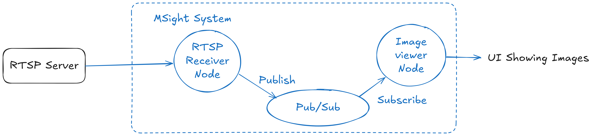

# RTSP Streaming Tutorial
### (RTSP Server → RTSP Receiver Node → Image Viewer)

This tutorial demonstrates the **simplest end-to-end example** of using MSight to retrieve image data from a camera-like sensor. We will:

1. Start a **local RTSP server** that streams a looping MP4 file.  
2. Launch an **RTSP Receiver Node** in MSight that subscribes to the RTSP stream and publishes image frames to a topic.  
3. Launch an **Image Viewer Node** that subscribes to the same topic and displays the incoming frames.

This forms the basic pipeline:

```
 ┌──────────────┐        ┌───────────────────┐        ┌────────────────────┐
 │  RTSP Server │  --->  │ RTSP Receiver Node │  --->  │ Image Viewer Node │
 └──────────────┘        └───────────────────┘        └────────────────────┘
             (RTSP)                   (MSight Topic)
```

---

## Prerequisites# RTSP Streaming Tutorial

This tutorial demonstrates the **simplest end-to-end example** of using MSight to retrieve image data from a camera-like sensor. We will:

1. Start a **local RTSP server** that streams a looping MP4 file.  
2. Launch an **RTSP Receiver Node** in MSight that subscribes to the RTSP stream and publishes image frames to a topic.  
3. Launch an **Image Viewer Node** that subscribes to the same topic and displays the incoming frames.

This forms the basic pipeline:

{ width="100%" }

---

## Prerequisites

Make sure the following are installed and ready:

- **Docker**  
- An MP4 video named **sample.mp4** in your working directory  
- **MSight** installed (`pip install msight-edge`)  

---

## Step 1 — Start the RTSP Server

Create a file named **`docker-compose.yml`** in the same directory as your `sample.mp4` video file:

```yaml
version: "3.9"

services:
  rtsp-server:
    image: bluenviron/mediamtx:latest
    container_name: rtsp-server
    restart: unless-stopped
    ports:
      - "8554:8554"
    environment:
      MTX_PROTOCOLS: "udp,tcp"

  video-source:
    image: jrottenberg/ffmpeg:4.4-alpine
    container_name: rtsp-video-source
    restart: unless-stopped
    depends_on:
      - rtsp-server
    volumes:
      - .:/data:ro
    command: >
      -re -stream_loop -1
      -loglevel info
      -fflags nobuffer
      -flags low_delay
      -i /data/sample.mp4
      -an
      -c:v libx264
      -preset veryfast
      -tune zerolatency
      -pix_fmt yuv420p
      -profile:v baseline
      -g 24 -keyint_min 24 -sc_threshold 0
      -f rtsp
      -rtsp_transport udp
      rtsp://rtsp-server:8554/live.stream
```

Start the RTSP server:

```
docker compose up
```

Once running, your stream will be available at:

```
rtsp://localhost:8554/live.stream
```

---

## Step 2 — Start Redis

Redis is required for MSight node registration and pub/sub communication.

Run Redis via Docker:

```
docker run --rm -p 6379:6379 redis
```

---

## Step 3 — Start the RTSP Receiver Node

Run:

```
msight_launch_rtsp -n rtsp_node -pt rtsp_topic --sensor-name rtsp_sensor -u rtsp://localhost:8554/live.stream -g 0 --rtsp-transport tcp
```

### Argument Explanation

| Argument | Meaning |
|---------|---------|
| `-n rtsp_node` | Unique node name used for MSight node registration |
| `-pt rtsp_topic` | Topic name where image frames will be published |
| `--sensor-name rtsp_sensor` | Identifier for this camera/source; embedded into all outgoing frame messages |
| `-u` | RTSP URL of the video stream |
| `-g 0` | Gap value — `0` means publish **every frame** |
| `--rtsp-transport tcp` | Use TCP transport for RTSP reception |

When this node starts, it will continuously receive frames from the RTSP stream and publish them into the `rtsp_topic` topic.

---

## Step 4 — View Images with the Image Viewer Node

To display the frames published on `rtsp_topic`, run:

```
msight_launch_image_viewer -st rtsp_topic --name viewer
```

A window should appear showing your MP4 video being streamed through your RTSP server → MSight receiver → MSight viewer pipeline.

If you see the video playing, you have successfully completed the tutorial!

---