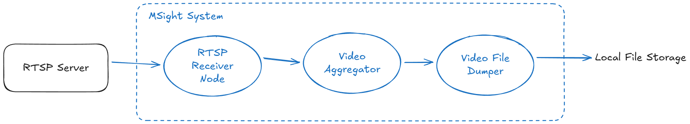

## Overview

This tutorial introduces a representative data-handling workflow in the MSight system: aggregating real-time image streams into video files. In MSight, an RTSP node connects to a live video source (such as an IP camera or video encoder), decodes the incoming stream, and publishes image frames in real time to the MSight pub/sub infrastructure. Downstream subscribers can consume these frames immediately for perception, analytics, or logging tasks. In this example, we focus on a simple yet practical consumption use case—using an aggregation node to subscribe to the image stream, sequentially collect incoming frames, and encode them into video files that are then written to the local file system. This workflow illustrates how MSight cleanly decouples real-time data ingestion from downstream processing while preserving temporal ordering, consistency, and system scalability. 

{: style="width:100%;" }

*Figure 1: Image frames are published by the RTSP node into the MSight pub/sub system, subscribed by an aggregation node, and encoded into video files persisted to the local file system.*

## Prerequisites

Before proceeding with this tutorial, ensure that the following software components are available and properly installed on your system.

### MSight

The MSight framework must be installed and accessible in your working environment. This tutorial assumes that MSight is correctly set up, including its core runtime, node execution environment, and pub/sub communication layer. Please refer to the MSight installation guide for platform-specific instructions if MSight is not yet installed.

### Docker

Docker is required to run a lightweight RTSP server for streaming test video data. Using Docker allows the RTSP server to be deployed in an isolated and reproducible manner without additional system configuration. Ensure that Docker Engine is installed and that the `docker` command is available from your terminal.

### Redis

MSight relies on Redis as the underlying pub/sub message broker in this example. Redis must be running and reachable by MSight nodes. The simplest way to start Redis is via Docker, as shown below:

```bash
docker run -d \
  --name msight-redis \
  -p 6379:6379 \
  redis:7
```

This command launches a Redis container in detached mode, exposes the default Redis port (`6379`) on the host machine, and uses the official Redis image. Once started, MSight nodes can connect to Redis using `localhost:6379` unless otherwise configured.

## Step 1 — Start the RTSP Server

To simulate a live video source, we will start a local RTSP server that streams a sample MP4 video file in a continuous loop. This server provides the RTSP stream that the MSight RTSP node will connect to.

Prepare a video file named `sample.mp4`. Create a file in the same folder called `docker-compose.yml`:

```yaml
version: "3.9"

services:
  rtsp-server:
    image: bluenviron/mediamtx:latest
    container_name: rtsp-server
    restart: unless-stopped
    ports:
      - "8554:8554"        # RTSP
    environment:
      MTX_PROTOCOLS: "udp,tcp"   # allow both

  video-source:
    image: jrottenberg/ffmpeg:4.4-alpine
    container_name: rtsp-video-source
    restart: unless-stopped
    depends_on:
      - rtsp-server
    volumes:
      - .:/data:ro    # sample.mp4 is here
    command: >
      -re -stream_loop -1
      -loglevel info
      -fflags nobuffer
      -flags low_delay
      -i /data/sample.mp4
      -an
      -c:v libx264
      -preset veryfast
      -tune zerolatency
      -pix_fmt yuv420p
      -profile:v baseline
      -g 24 -keyint_min 24 -sc_threshold 0
      -f rtsp
      -rtsp_transport udp
      rtsp://rtsp-server:8554/live.stream
```

Start the RTSP server:

```bash
docker compose up
```

You now have a fully functional RTSP video source streaming `sample.mp4` in a continuous loop.

---

## Step 2 — Start the MSight RTSP Node

In a new terminal window, start the MSight RTSP node to connect to the RTSP stream:

```bash
msight_launch_rtsp \
  -n rtsp_node \
  -u rtsp://localhost:8554/live.stream \
  -pt rtsp_images \
  --sensor-name test_camera
```

**Command explanation:**

* `msight_launch_rtsp`: Launches an MSight RTSP ingestion node.
* `-n rtsp_node`: Assigns a unique node name within the MSight runtime.
* `-u rtsp://localhost:8554/live.stream`: Specifies the RTSP stream URL to connect to.
* `-pt rtsp_images`: Publishes decoded image frames to the `rtsp_images` pub/sub topic.
* `--sensor-name test_camera`: Tags all published frames with a logical sensor name, which is propagated downstream and used for naming outputs and metadata.

This command launches an MSight node that connects to the RTSP stream and publishes decoded image frames into the MSight pub/sub system.

You should see log output similar to the following:

```bash
2026-01-24 11:28:45,684 - testing - rtsp_node - INFO :: Got image from test_camera, the image shape is (546, 1280, 3), time: 2026-01-24T11:28:45.649586
2026-01-24 11:28:45,730 - testing - rtsp_node - INFO :: Got image from test_camera, the image shape is (546, 1280, 3), time: 2026-01-24T11:28:45.685245
```

---

## Step 3 — Start the Image Aggregator Node

In another terminal window, start the MSight Image Aggregator node to subscribe to the image stream and aggregate frames into video segments:

```bash
msight_launch_image_to_video_aggregator \
  -n image_aggregator \
  -st rtsp_images \
  -pt aggregated_video \
  --fps 10 \
  --buffer-size 100 \
  --overlap-size 0
```

**Command explanation:**

* `msight_launch_image_to_video_aggregator`: Launches an aggregation node that converts image streams into video segments.
* `-n image_aggregator`: Sets the unique node name.
* `-st rtsp_images`: Subscribes to the `rtsp_images` topic for incoming image frames.
* `-pt aggregated_video`: Publishes encoded video segments to the `aggregated_video` topic.
* `--fps 10`: Target frame rate for the output video files.
* `--buffer-size 100`: Number of image frames buffered before triggering video encoding.
* `--overlap-size 0`: Number of frames shared between consecutive video segments (set to zero for non-overlapping clips).

This node buffers incoming image frames, encodes them into video files at the specified frame rate, and publishes the resulting video artifacts downstream.

---

## Step 4 — Dump Videos to the Local File System

In another terminal window, start the MSight Video Dumper node to subscribe to the aggregated video stream and persist the video files locally:

```bash
msight_launch_video_local_dumper \
  -n video_dumper \
  -st aggregated_video \
  --save-dir ./received_videos
```

**Command explanation:**

* `msight_launch_video_local_dumper`: Launches a node that persists received video data to disk.
* `-n video_dumper`: Sets the node name.
* `-st aggregated_video`: Subscribes to the `aggregated_video` topic.
* `--save-dir ./received_videos`: Directory where video files and associated metadata are written.

The received video files and their associated metadata will be written to the `received_videos` directory. After a few seconds, you should see files named similar to:

* `test_camera_20260124_112900_000000.mp4`
* `test_camera_20260124_112900_000000.json`

At this point, you have successfully aggregated real-time image streams into video files using MSight.
