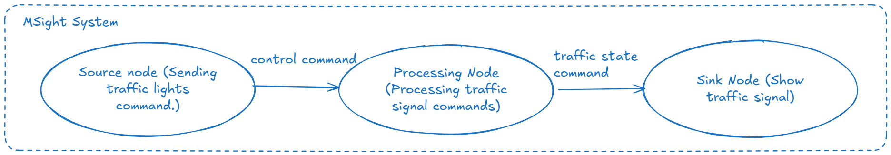

# Bring Your Own Node (BYON)

This document introduces the **Bring Your Own Node (BYON)** workflow in MSight and provides a step-by-step guide for creating custom nodes to implement application-specific functionality within the MSight runtime. To illustrate the end-to-end development process, we use a simple, self-contained example consisting of three nodes. A **source node** generates control commands in the form of byte-encoded messages (e.g., a switch signal), a **processing node** consumes and interprets these commands by translating them into traffic signal states (red, yellow, green), and a **sink node** receives the processed output and renders a basic user interface to visualize the resulting signal state. While the example itself is intentionally lightweight and synthetic, it captures the core concepts of node design, inter-node messaging, and data flow that apply to real-world MSight deployments.

{ width="100%" }
---

## Step 1: Implement the Source Node (Command Generator)

In the first step of the BYON tutorial, we implement a **source node** that periodically generates control commands and publishes them into the MSight data pipeline. This node simulates an upstream control signal (e.g., a phase switch request) and serves as the entry point of our three-node example.

Below is the complete source code for the command-generating node:

```python
from msight_core.nodes import SourceNode, NodeConfig
from msight_core.data import BytesData
import time


class CommandSourceNode(SourceNode):
    """A source node that generates command messages as bytes data.

    Args:
        SourceNode (SourceNode): The base source node class.
    """

    default_configs = NodeConfig(
        publish_topic_data_type=BytesData,
    )

    def __init__(self, config):
        super().__init__(config)
    
    def get_data(self):
        """
        This is the main function to override to generate data.
        In this example, we generate a simple command message as BytesData and wait for 2 seconds between messages.
        """
        command_message = b"NEXT_PHASE"
        time.sleep(2)
        self.logger.info(
            f"Generated command message: {command_message}, sending to topic: {self.publish_topic.name}"
        )
        return BytesData(
            data=command_message,
            sensor_name=self.sensor_name,
        )
    

if __name__ == "__main__":
    config = NodeConfig(
        publish_topic_name="command_topic",
        name="CommandSourceNode",
        sensor_name="CommandSourceSensor",
    )
    node = CommandSourceNode(config)
    node.spin()
```

### Code Walkthrough

**1. Node Class Definition**
`CommandSourceNode` subclasses `SourceNode`, meaning that it actively produces data rather than consuming it. In MSight, all source nodes must explicitly define two key elements at the class level: (1) the `get_data()` method, which specifies how the source node generates data and is executed periodically by the runtime, and (2) the publish data type, which is declared through the node’s class-level configuration. In MSight, the publish data type is specified via the `default_configs` attribute using `publish_topic_data_type`, and the framework provides universal data abstractions such as images, point clouds, and raw bytes. In this tutorial, we will be using the `BytesData` type.

**2. Node Entry Point**
When executed directly, the script creates a `NodeConfig` that defines:

* The output topic name (`command_topic`)
* The node name used by the runtime
* A logical sensor name for data provenance

The node is then instantiated and started using `node.spin()`, which hands control over to the MSight event loop.

At runtime, this source node continuously emits command messages that downstream nodes can subscribe to and process. In the next step, we will implement a processing node that consumes these commands and translates them into traffic signal states.

---

## Step 2: Implement the Data Processing Node (Command Interpreter)

In the second step of the BYON tutorial, we implement a **data processing node** that subscribes to the command messages produced by the source node, interprets their contents, and publishes a transformed result downstream. In this example, the processing node converts a generic control command into a concrete traffic signal state.

Below is the complete source code for the command-processing node:

```python
from msight_core.nodes import DataProcessingNode, NodeConfig
from msight_core.data import BytesData


class CommandProcessNode(DataProcessingNode):
    default_configs = NodeConfig(
        publish_topic_data_type=BytesData,
    )

    def __init__(self, config):
        super().__init__(config)
        self.current_state = 0
        self.traffic_light_states = ["RED", "GREEN", "YELLOW"]

    def process(self, data):
        """
        This is the main function to override to process incoming data.
        In this example, we interpret the command message and update the traffic light state accordingly.
        """
        command = data.data.decode('utf-8')
        self.logger.info(
            f"Received command message: {command} from topic: {self.subscribe_topic.name}"
        )

        if command == "NEXT_PHASE":
            self.current_state = (self.current_state + 1) % len(self.traffic_light_states)
            new_state = self.traffic_light_states[self.current_state]
            self.logger.info(f"Transitioning to new traffic light state: {new_state}")
            data.data = new_state.encode('utf-8')
            return data
        else:
            self.logger.warning(f"Unknown command received: {command}")
            return None


if __name__ == "__main__":
    config = NodeConfig(
        subscribe_topic_name="command_topic",
        publish_topic_name="traffic_light_state_topic",
        name="CommandProcessNode",
    )
    node = CommandProcessNode(config)
    node.spin()
```

### Code Walkthrough

**1. Node Class Definition**
`CommandProcessNode` subclasses `DataProcessingNode`, indicating that it consumes data from an upstream topic, performs application-specific logic, and optionally publishes a transformed result. In MSight, all data processing nodes must implement the `process()` method, which is invoked whenever new data arrives on the subscribed topic.

**2. Data Type Declaration**
Similar to the source node, this processing node declares its output data contract through the `default_configs` attribute. By setting `publish_topic_data_type=BytesData`, the node specifies that it will emit byte-encoded messages after processing. This explicit declaration enables type checking and safe composition of nodes in the MSight pipeline.

**3. Internal State Management**
The node maintains a simple internal state using `self.current_state` and a predefined list of traffic signal phases (`RED`, `GREEN`, `YELLOW`). This demonstrates that processing nodes can be stateful and retain context across multiple incoming messages.

**4. process() Method**
The `process()` method is the core logic of the processing node:

* The incoming `BytesData` payload is decoded into a UTF-8 string command
* The node logs the received command and its source topic
* If the command is `NEXT_PHASE`, the traffic signal state is advanced cyclically
* The updated traffic signal state is encoded back into bytes and written into the same data object
* The modified data object is returned and published to the output topic

If the command is unrecognized, the method returns `None`, indicating that no output should be published for that input.

**5. Node Entry Point**
When run as a standalone script, the node is configured with:

* A subscribed input topic (`command_topic`)
* A published output topic (`traffic_light_state_topic`)
* A unique node name for runtime identification

Calling `node.spin()` starts the processing loop and allows the node to react to incoming command messages in real time.

At runtime, this processing node acts as the logical bridge between raw control commands and semantically meaningful traffic signal states. In the next step, we will implement a sink node that consumes these states and presents them to the user via a simple UI.

---

## Step 3: Implement the Sink Node (Lightweight Console UI)

In the final step of the BYON tutorial, we implement a **sink node** that subscribes to the traffic signal state topic and visualizes the received state. 
We use a small **console renderer**, the console UI prints a compact traffic light and updates it “in place” using ANSI escape sequences. (Most modern terminals support this; if yours does not, it will still print readable output.)

```python
from msight_core.nodes import SinkNode, NodeConfig


class ConsoleTrafficLightUI:
    """A tiny, dependency-free console UI for rendering traffic light states."""

    # ANSI color codes (works in most modern terminals)
    _RESET = "\033[0m"
    _DIM = "\033[2m"
    _BOLD = "\033[1m"
    _RED = "\033[31m"
    _YELLOW = "\033[33m"
    _GREEN = "\033[32m"

    def __init__(self, enable_ansi=True):
        self.enable_ansi = enable_ansi
        self._printed_once = False

    def set_state(self, state):
        """Render the current traffic light state to the console."""
        state = (state or "").strip().upper()
        if state not in ("RED", "YELLOW", "GREEN"):
            state = "OFF"

        # Decide which lamp is active
        active = {"RED": state == "RED", "YELLOW": state == "YELLOW", "GREEN": state == "GREEN"}

        def lamp(on, color_code):
            if not self.enable_ansi:
                return "●" if on else "○"
            return f"{color_code}{self._BOLD}●{self._RESET}" if on else f"{self._DIM}○{self._RESET}"

        red = lamp(active["RED"], self._RED)
        yellow = lamp(active["YELLOW"], self._YELLOW)
        green = lamp(active["GREEN"], self._GREEN)

        header = f"Traffic Light State: {state}"
        body = f"\n  {red}\n  {yellow}\n  {green}\n"

        # Clear previously printed block (simple in-place refresh)
        if self.enable_ansi and self._printed_once:
            # Move cursor up 5 lines (1 header + 3 lamps + trailing blank) and clear to end
            print("\033[5F\033[J", end="")

        print(header + body, end="")
        self._printed_once = True


class TrafficLightSinkNode(SinkNode):
    """A sink node that receives traffic light state messages and displays them."""

    def __init__(self, config, ui=None):
        super().__init__(config)
        self.ui = ui or ConsoleTrafficLightUI()

    def on_message(self, data):
        """Handle incoming data and update the UI."""
        traffic_light_state = data.data.decode("utf-8")
        traffic_light_state = traffic_light_state.strip().upper()

        self.logger.info(
            f"Received traffic light state: {traffic_light_state} from topic: {self.subscribe_topic.name}"
        )

        # Minimal, clear sink-node behavior: render the latest state
        self.ui.set_state(traffic_light_state)


if __name__ == "__main__":
    config = NodeConfig(
        subscribe_topic_name="traffic_light_state_topic",
        name="TrafficLightSinkNode",
    )
    node = TrafficLightSinkNode(config)
    node.spin()
```
### Code Walkthrough
**1. ConsoleTrafficLightUI Class**
This helper class encapsulates the logic for rendering a simple traffic light UI in the console. It uses ANSI escape codes to colorize the output and refresh the display in place. The `set_state()` method takes a traffic light state string and updates the console output accordingly.

**2. TrafficLightSinkNode Class**
`TrafficLightSinkNode` subclasses `SinkNode`, indicating that it consumes data without producing any further output. The node overrides the `on_message()` method, which is called whenever new data arrives on the subscribed topic.

**3. on_message() Method**
The `on_message()` method decodes the incoming `BytesData` payload to extract the traffic light state string. It logs the received state and then invokes the `set_state()` method of the `ConsoleTrafficLightUI` instance to update the console display.

## Conclusion

With Step 3 complete, you now have a full three-node BYON pipeline:

1. **Source:** emits `NEXT_PHASE` commands on `command_topic`
2. **Processing:** converts commands into `RED/GREEN/YELLOW` on `traffic_light_state_topic`
3. **Sink:** renders the latest state in a lightweight console UI
