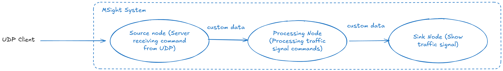

# Bring Your Own Node 3: Custom Data Type

From the previous tutorials, you have learned how to build both **pull‑based source nodes** and **event‑driven server source nodes** in MSight, and how data flows through a processing node and into a sink node. In all of those examples, we relied on **standard MSight data types**—most notably `BytesData`—to carry command messages through the node graph.

In this tutorial, we will further extend the BYON series by introducing a **custom data type**. While the overall node structure remains exactly the same as in the previous tutorial, we will replace the generic `BytesData` payload with a purpose‑built `CommandData` class that explicitly represents command semantics. This pattern is useful when your application needs to carry structured or domain‑specific information that does not naturally fit into MSight’s built‑in data abstractions.

By the end of this tutorial, you will understand how to define a custom MSight data type, how to declare it in node configurations, and how to use it seamlessly across source, processing, and sink nodes.

{ width="100%" }
---

## Defining a Custom MSight Data Type

The first step in using a custom payload is to define a new **data class** that represents the semantics of your application. In MSight, custom data types are typically created by subclassing `SensorData`, which provides the common metadata fields and interfaces expected by the runtime.

In this tutorial, instead of passing around raw bytes, we define a `TrafficLightCommandData` class to explicitly represent traffic‑light control information.

```python
from msight_core.data import SensorData
from dataclasses import dataclass, field


@dataclass
class TrafficLightCommandData(SensorData):
    command: str = field(default="")          # Command to change traffic light state
    traffic_state: str = field(default="none")  # Current state of the traffic light

    def get_traffic_state(self) -> str:
        """Get the current traffic light state."""
        return self.traffic_state.upper().strip()
```

### Explanation

**1. Subclassing `SensorData`**
All MSight data objects inherit from `SensorData`. This ensures that the custom data type integrates cleanly with the MSight runtime, including metadata handling (e.g., sensor name, timestamps) and compatibility checks between nodes.

**2. Using `@dataclass` for clarity**
The `@dataclass` decorator is used to define the data container declaratively. This keeps the data structure explicit, readable, and easy to extend, while avoiding unnecessary boilerplate code. For more details on Python dataclasses, see the [official Python documentation](https://docs.python.org/3/library/dataclasses.html).

**3. Domain‑specific fields**
`TrafficLightCommandData` introduces two explicit fields:

* `command`: represents the incoming control instruction (for example, `NEXT_PHASE`)
* `traffic_state`: represents the interpreted or current traffic light state (e.g., `RED`, `GREEN`, `YELLOW`)


**4. Helper methods for downstream nodes**
The `get_traffic_state()` method provides a small but useful abstraction for downstream nodes. Instead of repeatedly normalizing string values, nodes can rely on a consistent accessor that returns a canonical, uppercase traffic light state.

### Why a custom data type matters

Compared to `BytesData`, this custom data type:

* Makes the **intent of the data explicit**
* Reduces ad‑hoc encoding and decoding logic
* Improves readability and maintainability of processing and sink nodes
* Provides a clear extension point if additional fields (timestamps, priorities, IDs) are needed later

In the next sections, we will update the source, processing, and sink nodes to use `TrafficLightCommandData` instead of `BytesData`, while keeping the overall node topology unchanged.

---

## Updating the Source Node: From Raw Bytes to Structured Data

With a custom data type, the source node instead of to emit raw bytes, it should **interpret the incoming payload at the data boundary** and populate a domain‑specific data object.

In the updated server source node, the key data‑related changes are:

**1. Declaring the publish data type**
The node configuration now declares the custom data type as its output contract (replacing `BytesData`). This makes the data semantics explicit at the graph level and ensures downstream nodes know exactly what type to expect.

**2. Translating raw input into structured data**
When a UDP datagram arrives, the server infrastructure delivers raw bytes to the node’s message handler. Instead of wrapping those bytes directly, the source node interprets them as a command string and constructs a `TrafficLightCommandData` instance. At this stage, only the `command` field is populated; the `traffic_state` field is left unset or initialized to a default value.


---

### Focusing on the Data Boundary: `on_message()` in Detail

The **only place** where the custom data type is constructed in the source node is the `on_message()` method. This method marks the exact boundary where raw network bytes are translated into a typed MSight data object.

Below is the full `on_message()` implementation used in this tutorial:

```python
def on_message(self, raw_bytes: bytes):
    """Translate raw bytes into MSight data and publish."""
    if not raw_bytes:
        return

    decoded = raw_bytes.decode('utf-8')

    # Publish as TrafficLightCommandData into MSight graph
    payload = TrafficLightCommandData(
        command=decoded,
    )

    self.logger.info(
        f"Published command bytes: {payload.command} to topic: {self.publish_topic.name}"
    )

    return payload
```

---

## Updating the Processing Node: Filling Structured Data Fields

With a custom data type in place, the **processing node no longer needs to reinterpret raw bytes or perform decoding**. Instead, it operates directly on structured fields provided by `TrafficLightCommandData`, which is the recommended usage pattern and aligns with MSight’s design philosophy.

The relevant logic in the `process()` method looks like this:

```python
command = data.command

if command == "NEXT_PHASE":
    self.current_state = (self.current_state + 1) % len(self.traffic_light_states)
    new_state = self.traffic_light_states[self.current_state]

    # Update the structured field instead of rewriting bytes
    data.traffic_state = new_state
    return data
```

### Explanation

**1. data in the processing node**
Note that the data in the processing method is already a `TrafficLightCommandData` instance. There is no need to decode bytes or reconstruct the command string; MSight has handled the deserialization, and used as the python object, just as if it were created natively.

**2. Updating data in place**
Instead of creating a new data object or overwriting a raw payload, the node updates the `traffic_state` field of the existing `TrafficLightCommandData` instance. This preserves context carried by the data object (such as metadata inherited from `SensorData`) and makes the transformation explicit.

---

## Updating the Sink Node: Seamless Deserialization via Data Type Registration

The sink node remains largely unchanged in terms of control flow: it receives the message, extracts the traffic light state, logs it, and renders it in the console UI. The key difference in the custom-data workflow is that the sink node now receives a fully-typed `TrafficLightCommandData` object, so it can read the result through a semantic accessor (for example, `get_traffic_state()`) rather than decoding raw bytes.

### The one line that matters: importing the custom data type

MSight maintains a **global data-type registry** so that incoming messages can be deserialized back into the correct Python class. For custom data types, the registration typically occurs when the module defining the data type is imported.

That is why this import is required—even if `TrafficLightCommandData` does not appear to be referenced directly in the sink-node logic:

```python
from data import TrafficLightCommandData  # required to register the custom data type
```

If you omit this import, you may see a registry-related error during deserialization because the runtime cannot resolve the payload’s declared type back into a Python class.

### Minimal sink-node logic with custom data

Once the type is registered, deserialization is seamless: the `on_message()` callback receives a `TrafficLightCommandData` instance and you can consume it directly.

```python
traffic_light_state = data.get_traffic_state()
self.ui.set_state(traffic_light_state)
```
For the full code, you can refer the [tutorial source code](https://github.com/michigan-traffic-lab/MSight_tutorials/tree/main/bring_your_own_node_custom_data) and try to run the full code.
