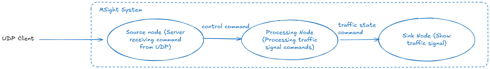

## Bring Your Own Node 2: Server Source Node

In the previous BYON example, you should now be able to implement most **pull‑based data ingestion workflows** with the MSight system. External data is grabbed from the source node by periodically executing the `get_data()` method. This design works well when the node controls when and how data is retrieved—but it introduces limitations when data must arrive asynchronously from external systems. In many cases, a source node must operate as a server—such as a UDP, TCP, or WebSocket server. 

In this tutorial, we extend the previous BYON pipeline by replacing the original source node with a **UDP server node**, while keeping the data processing node and sink node unchanged. The new source node listens on a UDP socket for incoming command messages, wraps the received bytes into MSight data objects, and publishes them into the graph. This pattern reflects a common real-world deployment scenario in which MSight passively ingests commands or sensor data initiated by external systems—such as traffic controllers, simulators, or roadside devices—rather than actively polling for data.

By the end of this tutorial, you will understand how to implement a server‑style source node, manage blocking I/O safely within MSight’s execution model, and bridge external network input into a standard MSight processing pipeline.

{ width="100%" }

## Preparation

For this tutorial, the **data processing node** and **sink node** remain exactly the same as in the previous BYON example. Please set them up following the steps from the last tutorial and ensure they are working correctly before proceeding. The only component that changes in this workflow is the **source node**, which will now be implemented as a UDP server that waits for external commands.

---

## Writing a Server‑Style Source Node in MSight

Before looking at the code, it is important to understand how a **server source node** differs from a pull‑based source node in MSight.

In a pull‑based source node, MSight periodically invokes `get_data()` and the node *decides when to fetch or generate data*. In contrast, a server‑style source node is **event‑driven**: external systems push data into the node, and the node reacts only when data arrives. For this reason, a server source node typically:

* Initializes and manages a server (UDP, TCP, WebSocket, etc.) during node startup
* Runs the server loop inside the node’s lifecycle
* Converts incoming network messages into MSight data objects

In MSight, this pattern is implemented by overriding three methods:

* `initialize()` – set up sockets or server objects
* `serve()` – start the server loop and wait for external input, here you need to hook `handle_incoming(raw_data)` to the server's data callback, in other word, the data arrived from external systems should be fed into `handle_incoming(raw_data)`
* `on_message()` – handle raw incoming messages and translate them into MSight data, return the data object to be published

Below is a complete example of a **UDP server source node** implemented using Python’s standard‑library `socketserver` module.

---

## CommandServerSourceNode (UDP Server)

```python
import socketserver

from msight_core.nodes import NodeConfig, ServerSourceNode
from msight_core.data import BytesData


class CommandServerSourceNode(ServerSourceNode):
    """A UDP server source node that receives external command messages and publishes them as BytesData."""

    default_configs = NodeConfig(
        publish_topic_data_type=BytesData,
        heartbeat_tolerance=-1, # Disable heartbeat for server nodes
    )

    def __init__(self, config, host, port):
        super().__init__(config)
        self.server = None
        self._host = host
        self._port = port

    # -----------------------------
    # 1) initialize(): setup server
    # -----------------------------
    def initialize(self):
        """Initialize UDP server resources."""

        node = self  # capture for the handler

        class _UDPHandler(socketserver.BaseRequestHandler):
            def handle(self):
                # BaseRequestHandler for UDP: request = (data, socket)
                data, _sock = self.request
                client = self.client_address

                # Wire raw bytes into the MSight node
                node.handle_incoming(data)

        # ReusableUDPServer avoids "address already in use" for rapid restarts
        class _ReusableUDPServer(socketserver.ThreadingUDPServer):
            allow_reuse_address = True

        self.server = _ReusableUDPServer((self._host, self._port), _UDPHandler)
        self.logger.info(f"UDP server initialized on {self._host}:{self._port}")

    # -----------------------------
    # 2) serve(): run server loop
    # -----------------------------
    def serve(self):
        """Run the UDP server loop (blocking)."""
        if self.server is None:
            raise RuntimeError("Server is not initialized. Call initialize() first.")

        self.logger.info("UDP server is now serving (waiting for external commands)...")
        self.server.serve_forever(poll_interval=0.2)

    def on_message(self, raw_bytes: bytes):
        """Translate raw bytes into MSight data and publish."""
        if not raw_bytes:
            return

        # Publish as BytesData into MSight graph
        payload = BytesData(
            data=raw_bytes,
            sensor_name=self.sensor_name,
        )

        self.logger.info(
            f"Published command bytes: {payload.data} to topic: {self.publish_topic.name}"
        )

        return payload


if __name__ == "__main__":
    # Note: host/port are optional here; include them if your NodeConfig supports custom fields.
    config = NodeConfig(
        publish_topic_name="command_topic",
        name="CommandServerSourceNode",
        sensor_name="CommandServerSourceSensor",
    )
    HOST, PORT = "localhost", 9999
    node = CommandServerSourceNode(config, HOST, PORT)
    node.spin()
```

### Notes on the implementation

* **`socketserver.ThreadingUDPServer`** is used so each incoming datagram is handled on a worker thread. For this tutorial, it keeps the server responsive even if downstream processing briefly takes time.
* `handle_income(...)` is the **integration point** between network callbacks and MSight logic.
* `on_message(...)` is intentionally small: it wraps bytes into `BytesData` and publishes.

---

## Dummy UDP Client (Manual Trigger)

To test the server source node, the following lightweight UDP client can be used. The client waits for user input and sends a `NEXT_PHASE` command whenever the user types **`n`** and presses Enter.

```python
import socket

SERVER_HOST = "127.0.0.1"
SERVER_PORT = 9999

sock = socket.socket(socket.AF_INET, socket.SOCK_DGRAM)

print("UDP client started. Type 'n' + Enter to send NEXT_PHASE command. Ctrl+C to exit.")

while True:
    user_input = input("> ").strip().lower()

    if user_input == "n":
        message = b"NEXT_PHASE"
        sock.sendto(message, (SERVER_HOST, SERVER_PORT))
        print("Sent NEXT_PHASE command")
```

With this client running, each press of **`n`** triggers:

1. A UDP message sent to the server source node
2. Publication of `BytesData` on `command_topic`
3. Processing by the existing data processing node
4. Visualization by the unchanged sink node

At this point, you have completed a full **event‑driven BYOS pipeline**, where MSight reacts to externally initiated network commands rather than polling for data.

---
### How to run the full pipeline

1. Start the **processing node** (same as previous tutorial): it subscribes to `command_topic` and publishes traffic light state to `traffic_light_state_topic`.
2. Start the **sink node** (same as previous tutorial): it subscribes to `traffic_light_state_topic` and displays the state.
3. Start the **UDP server source node** above: it publishes to `command_topic`.
4. Run the **UDP client** and type `n` to trigger phase changes.

At this point, each time you type `n`, the command flows:

`UDP Client → UDP Server Source Node → Processing Node → Sink Node`
