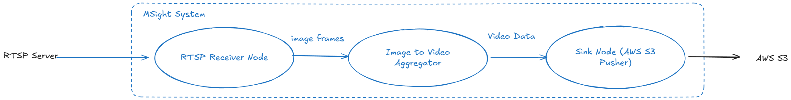

# S3 Video Uploader Tutorial

This tutorial demonstrates how to build an end-to-end cloud upload pipeline in **MSight** that transforms live image streams into persistent video assets stored in AWS S3. Specifically, the workflow ingests image frames from an RTSP server, aggregates them into an `.mp4` video stream, and uploads the resulting video to an Amazon S3 bucket for long-term storage and downstream access. This pattern is particularly suitable for edge deployments where real-time, short latency cloud streaming is not required; by aggregating data on the edge and leveraging video compression, the pipeline significantly reduces data volume and S3 PUT request frequency, making it substantially more cost-efficient than HTTP-based uploaders or Kinesis-based streaming approaches discussed in earlier tutorials.

The pipeline is achieved by using three MSight nodes to reflect real-world, production-grade system design. A **source node** connects to the RTSP server and publishes decoded image frames into the MSight pub/sub system. A **processing node** subscribes to the image stream and performs temporal aggregation and video encoding. Finally, a **sink node** receives the generated video segments and uploads them to AWS S3.

{ width="100%" }
## Prerequisites

Before starting this tutorial, ensure the following dependencies and services are available on the edge device:

### 1. MSight Installation

MSight must be installed and properly configured on the edge device. 

### 2. Docker

If Docker is not yet installed, follow the official installation guide for your platform:

* [Docker installation guide](https://docs.docker.com/get-docker/)

After installation, verify Docker is available:

```bash
docker --version
```

### 3. Redis (Message Broker)

MSight uses Redis as a lightweight pub/sub message broker in this tutorial. You can quickly launch a Redis instance using Docker:

```bash
docker run -d \
  --name msight-redis \
  -p 6379:6379 \
  redis:7
```

Once started, Redis will be accessible at `localhost:6379` by default.

### 4. AWS Credentials Configuration

The sink node uploads video files to Amazon S3 and therefore requires valid AWS credentials on the edge device. Ensure that an IAM user or role with appropriate S3 write permissions is available.

Configure credentials using the AWS CLI:

```bash
aws configure
```

You will be prompted to provide:

* AWS Access Key ID
* AWS Secret Access Key
* Default region name (e.g., `us-east-1`)
* Default output format (can be left empty)

For more information on AWS credentials and IAM permissions, see the [AWS Identity and Access Management (IAM) documentation](https://docs.aws.amazon.com/iam/).


## Setup an RTSP Server

For this tutorial, we use a lightweight, fully containerized RTSP setup based on Docker Compose. This setup includes two services:

* An **RTSP server** powered by MediaMTX (formerly rtsp-simple-server)
* A **video source container** that continuously streams a local `.mp4` file to the RTSP server using FFmpeg

This approach allows you to reproduce a stable RTSP stream without relying on physical cameras, which is ideal for development, testing, and documentation purposes.

### Docker Compose Configuration

Create a file named `docker-compose.yml` in an empty directory and place a sample video file (e.g., `sample.mp4`) in the same directory. Then add the following content:

```yaml
version: "3.9"

services:
  rtsp-server:
    image: bluenviron/mediamtx:latest
    container_name: rtsp-server
    restart: unless-stopped
    ports:
      - "8554:8554"        # RTSP
    environment:
      MTX_PROTOCOLS: "udp,tcp"   # allow both

  video-source:
    image: jrottenberg/ffmpeg:4.4-alpine
    container_name: rtsp-video-source
    restart: unless-stopped
    depends_on:
      - rtsp-server
    volumes:
      - .:/data:ro    # sample.mp4 is here
    # ffmpeg is the entrypoint; we only pass args:
    command: >
      -re -stream_loop -1
      -loglevel info
      -fflags nobuffer
      -flags low_delay
      -i /data/sample.mp4
      -an
      -c:v libx264
      -preset veryfast
      -tune zerolatency
      -pix_fmt yuv420p
      -profile:v baseline
      -g 24 -keyint_min 24 -sc_threshold 0
      -f rtsp
      -rtsp_transport udp
      rtsp://rtsp-server:8554/live.stream
```

### Launch the RTSP Server

From the directory containing `docker-compose.yml` and `sample.mp4`, start the RTSP services with:

```bash
docker compose up -d
```

Once the containers are running, an RTSP stream will be continuously available at:

```
rtsp://localhost:8554/live.stream
```

This RTSP endpoint will be used by the MSight source node in the next section to ingest image frames into the MSight data pipeline.

## Start the RTSP Source Node

With the RTSP server running, the next step is to launch an MSight **source node** that connects to the RTSP stream and publishes decoded image frames into the MSight pub/sub system.

Run the following command on the edge device:

```bash
msight_launch_rtsp \
  -n rtsp_node \
  -pt rtsp_topic \
  --sensor-name rtsp_sensor \
  -u rtsp://localhost:8554/live.stream \
  -g 0 \
  --rtsp-transport tcp
```

### Parameter Explanation

* `-n rtsp_node`: Assigns a unique name to this MSight node instance.
* `-pt rtsp_topic`: Specifies the MSight topic to which image frames will be published.
* `--sensor-name rtsp_sensor`: Logical sensor identifier used internally by MSight for data provenance and downstream processing.
* `-u rtsp://localhost:8554/live.stream`: RTSP stream URL provided by the MediaMTX server started in the previous step.
* `-g 0`: Selects the GPU device index. Set this to `-1` to force CPU decoding if no GPU is available.
* `--rtsp-transport tcp`: Forces TCP-based RTSP transport for improved stability on local or lossy networks.

Once started, this node continuously pulls frames from the RTSP stream, decodes them, and publishes image data to the `rtsp_topic`. Downstream MSight nodes will subscribe to this topic to perform video aggregation and cloud upload in subsequent steps.

## Start the Image-to-Video Aggregator Node

The next step in the pipeline is to aggregate incoming image frames into encoded video segments. This is handled by the MSight **image-to-video aggregator node**, which subscribes to the image topic published by the RTSP source node and outputs `.mp4` video clips at a controlled frame rate and segment length.

Launch the aggregator node using the following command:

```bash
msight_launch_image_to_video_aggregator \
  -n image-aggregator \
  -st rtsp_topic \
  -pt aggregated_video \
  --fps 10 \
  --buffer-size 100 \
  --overlap-size 0
```

### Parameter Explanation

* `-n image-aggregator`: Assigns a unique name to the image aggregation node.
* `-st rtsp_topic`: Specifies the subscribe topic from which raw image frames are subscribed.
* `-pt aggregated_video`: Defines the output topic to which encoded video segments are published.
* `--fps 10`: Sets the target frame rate of the generated video (frames per second).
* `--buffer-size 100`: Number of image frames buffered before emitting a video segment. With `fps=10`, this corresponds to approximately 10 seconds per video clip.
* `--overlap-size 0`: Number of overlapping frames between consecutive video segments. Setting this to zero ensures non-overlapping, disjoint clips.

At runtime, this node continuously buffers incoming frames from `rtsp_topic`, encodes them into `.mp4` video segments, and publishes the resulting video data to the `aggregated_video` topic. These video segments are then consumed by the downstream S3 sink node for cloud upload.

## Start the AWS S3 Video Uploader Node

The final step in the pipeline is to upload the aggregated video segments to Amazon S3. Before launching the uploader, create a new S3 bucket in your AWS account (for example, named `SOME_BUCKET_NAME`) using the [AWS Console or the AWS CLI](https://docs.aws.amazon.com/AmazonS3/latest/userguide/create-bucket-user-guide.html). This bucket will be used to store the aggregated video assets generated on the edge. Once the bucket is created and proper write permissions are in place, the MSight **AWS video pusher node** subscribes to the video topic produced by the aggregator and uploads each video segment to the specified S3 bucket and prefix.

Launch the S3 uploader node using the following command:

```bash
msight_launch_aws_video_pusher \
  -st aggregated_video \
  --name video_pusher \
  --bucket-name SOME_BUCKET_NAME \
  --prefix msight_tutorial
```

### Parameter Explanation

* `-st aggregated_video`: Specifies the subscribe topic from which encoded video segments are subscribed.
* `--name video_pusher`: Assigns a unique name to the S3 uploader node.
* `--bucket-name SOME_BUCKET_NAME`: Name of the target S3 bucket where video files will be uploaded. The bucket must already exist and be writable with the configured AWS credentials.
* `--prefix msight_tutorial`: Object key prefix used to organize uploaded videos within the bucket.

Once running, this node automatically uploads each received `.mp4` and its metadata (`.json`) video segment to S3 as it becomes available. Because videos are generated in aggregated, compressed form, this approach minimizes network bandwidth usage and significantly reduces the number of S3 PUT operations compared to frame-level or real-time streaming uploads.

At this point, the end-to-end pipeline is complete: RTSP images are ingested on the edge, aggregated into video segments, and reliably persisted to cloud storage using a cost-efficient, edge-first design.
